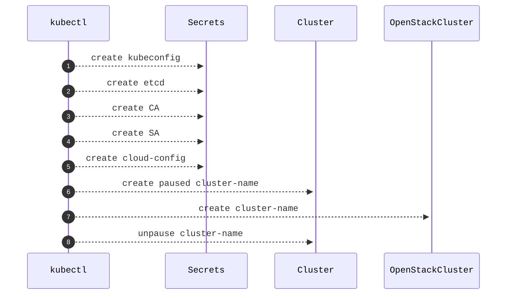

#### Cluster

```mermaid
%%{init:{"fontFamily":"monospace", "sequence":{"showSequenceNumbers":true}}}%%
sequenceDiagram
    kubectl-->>+Secrets: create kubeconfig
    kubectl-->>+Secrets: create etcd
    kubectl-->>+Secrets: create CA
    kubectl-->>+Secrets: create SA
    kubectl-->>+Secrets: create cloud-config
    kubectl-->>+Cluster: create paused cluster-name
    kubectl-->>+OpenStackCluster: create cluster-name
    kubectl-->>+Cluster: unpause cluster-name
```
